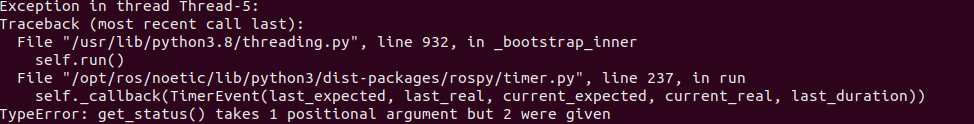

# ROS2 -> ROS1 Notes
(Read these notes while looking at the changes I have made in the files in the commit otherwise they wouldn't make any sense)

- The unique_id_finder file wasn't able to detect the GPS module:
    - For Ubuntu 22, the key used is "Standard". Changed that to "Dual USB" for Ubuntu 20
    - This fixed the problem though an error still occurs (which doesn't affect the code)
    - This error is because the "Dual USB" exists in both USB ports that are opened when GPS module is connected, where one of them gives device id and the other does not.
    - Had to do the same in serial_module.py file

- gps.py wasn't able to take the parameters from the launch file and config file
    - Had to fix how gps.py takes in the parameters
    - Removed the namespace (because everything is in calian_gnss)
    - Changed the structure of yaml files
    - Hardcoded the parameter key for every mode (check __init__ function in gps.py)
    - **Next Step**: Do the same for ntrip, pointperfect stuff and other .py files (like the visualizer)

- Events not callable error:
    

    - **Fixed** by using .fire() whenever an event object is called
    - ChatGPT output that helped: The line

    ```python
    self.ublox_message_found: Event[UBXMessage] = Event()
    ```

    creates an instance of the **Events** class (aliased to **Event**). Most Python “event” libraries (including [events](https://pypi.org/project/events/)) provide a mechanism like `some_event.fire(...)`, `some_event.emit(...)`, or `some_event.notify(...)` to trigger events—rather than calling the event object itself.

    In your code, you have lines like:

    ```python
    self.ublox_message_found(message)
    ```

    But if this Events library does **not** define a `__call__` method, then `self.ublox_message_found(...)` will fail with the error `'Events' object is not callable'`.

    If you truly want to call it like a function, you would need an event class that **is** callable. But typically, libraries named `events` or `pyee` or similar expect `.emit(...)` or `.fire(...)`.

    So, anywhere in your code that you have:

    ```python
    self.ublox_message_found(message)
    ```
    you likely need something like:

    ```python
    self.ublox_message_found.fire(message)
    ```


- Timer argument error:
    
    - Fixed by adding event=None in get_status function call
    - ChatGPT output: 
    In ROS Python, a `rospy.Timer` callback is always invoked with a single argument of type `TimerEvent`.
    When the timer fires, it ends up calling `get_status(self, timer_event)` and causes the error:

    ```
    TypeError: get_status() takes 1 positional argument but 2 were given
    ```

    To fix this, simply add an extra argument (often named `event` or `_`) to your `get_status` definition so that it looks like:

    ```python
    def get_status(self, event=None) -> None:
        status = self.ser.get_status()

        ...
    ```
    You do not need to use the `event` parameter inside the method if you do not care about the timer’s timing details.